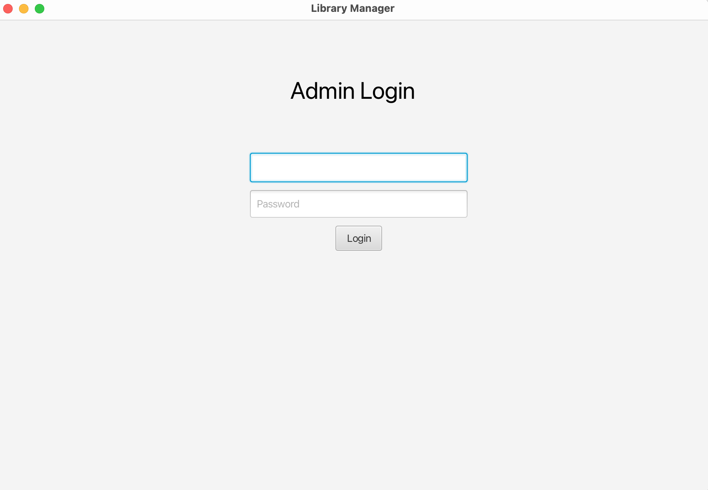
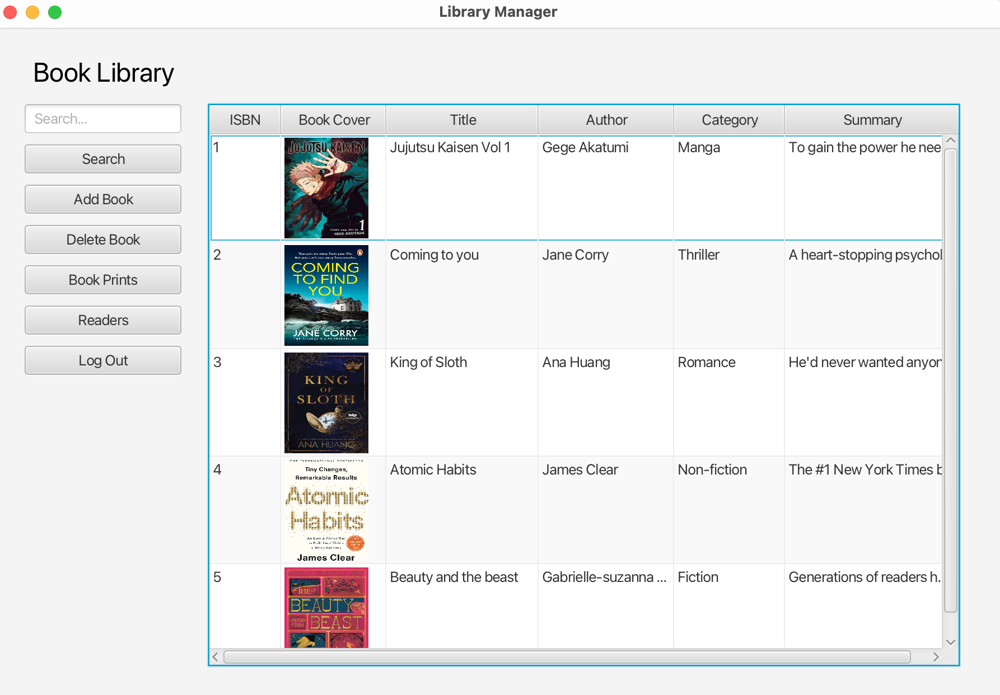
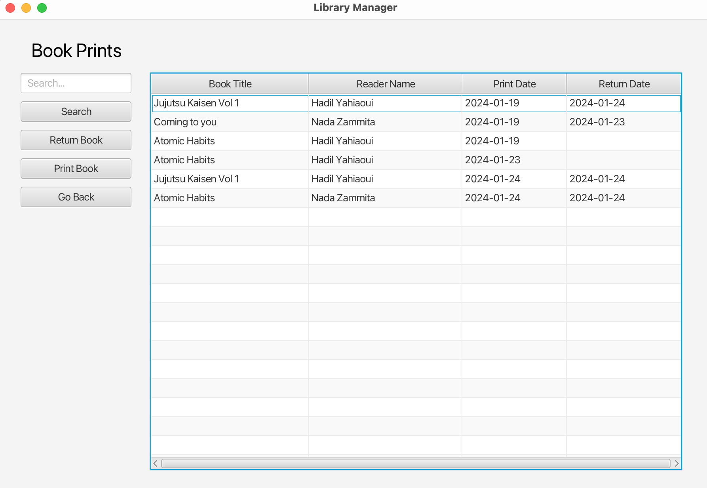
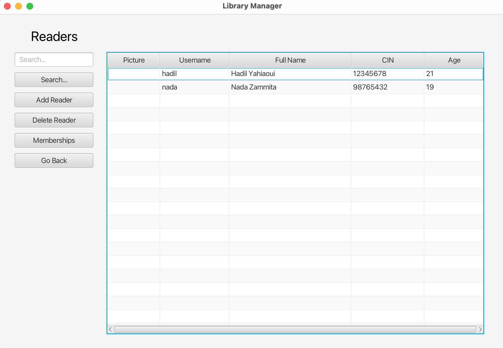
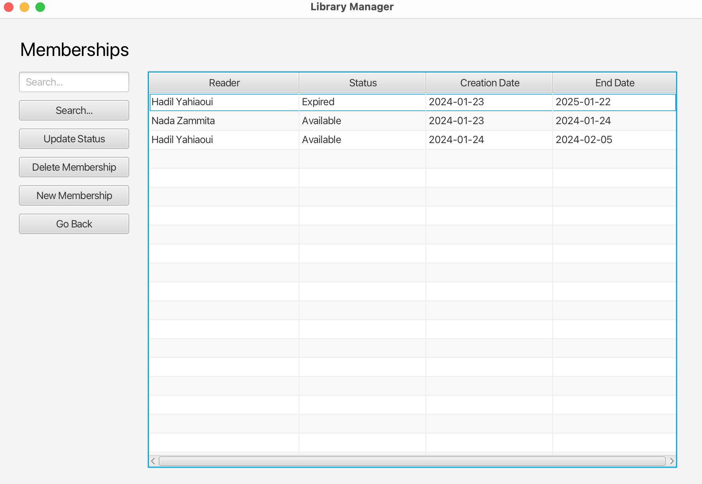

# Java Library Manager

Welcome to the Java Library Manager project! This application, built with JavaFX, serves as a comprehensive library management system. It enables users to manage books, readers, memberships, and transactions efficiently.

## Table of Contents
- [Prerequisites](#prerequisites)
- [Installation](#installation)
    - [Importing SQL Database](#importing-sql-database)
    - [Installing MariaDB JDBC Connector](#installing-mariadb-jdbc-connector)
    - [Running the Application](#running-the-application)
- [Features](#features)
- [Logging In as Admin](#logging-in-as-admin)
- [Contributing](#contributing)
- [License](#license)

## Prerequisites
Before you get started, make sure you have the following prerequisites installed on your system:
- Java Development Kit (JDK) 8 or higher
- JavaFX SDK
- MariaDB Server
- MariaDB JDBC Connector

## Installation

### Importing SQL Database
1. Open your preferred MySQL/MariaDB client (e.g., MySQL Workbench).
2. Create a new database named `projetJava`.
3. Import the SQL dump file provided (`projetJava.sql`) into the `projetJava` database. This file contains the necessary tables and sample data.

### Installing MariaDB JDBC Connector
1. Download the MariaDB JDBC Connector from the [official website](https://mariadb.com/kb/en/mariadb-connector-j/).
2. Add the JAR file (`mariadb-java-client-x.x.x.jar`) to your project's classpath.

### Running the Application
1. Clone the repository to your local machine.

    ```bash
    git clone https://github.com/hadily/java-library-manager.git
    ```

2. Open the project in your preferred Java IDE (e.g., IntelliJ IDEA, Eclipse).
3. Build and run the project.

## Features
This Java Library Manager project offers the following features:

1. **Login Page**

   

2. **Book Management**
    - Create a Book: Add new books to the library inventory.
    - Delete a Book: Remove books from the library collection.
    - Search for a Book: Easily find books using various search criteria.
   
    

3. **Transaction Management**
   - Print a Book: Record the borrowing of a book by a reader
   - Return a Book: Log the return of a borrowed book to the library.

   

4. **Reader Management**
    - Create a Reader: Register new readers who can borrow books.
    - Delete a Reader: Remove readers from the library system.
    - Search for a Reader: Locate readers based on different search parameters.
   
    

5. **Membership Management**
    - Create Memberships: Establish memberships for readers, enabling them to borrow books.
    - Delete Memberships: Remove memberships for readers who no longer wish to participate.
      
    


### Logging In as Admin
On the login page, use the following credentials to log in as the admin:
- Username: admin
- Password: root

Please change the default admin password after the first login for security reasons.

## Contributing
Feel free to contribute to the project by submitting bug reports, feature requests, or code improvements. Follow the standard GitHub workflow:
1. Fork the repository.
2. Create a new branch for your changes.
3. Make your changes and commit them.
4. Push your changes to your fork.
5. Create a pull request.

## License
Feel free to use, modify, and contribute!